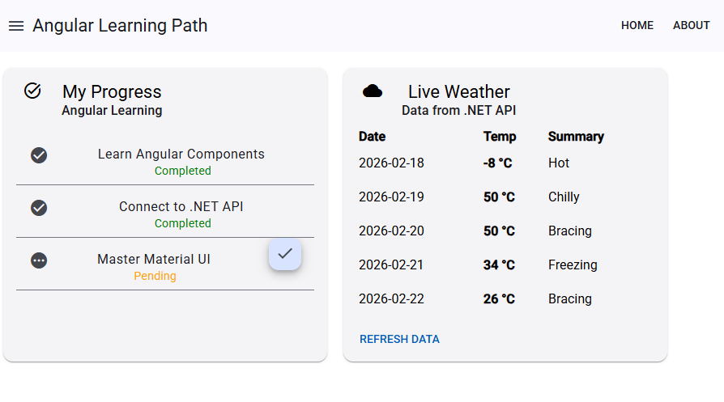
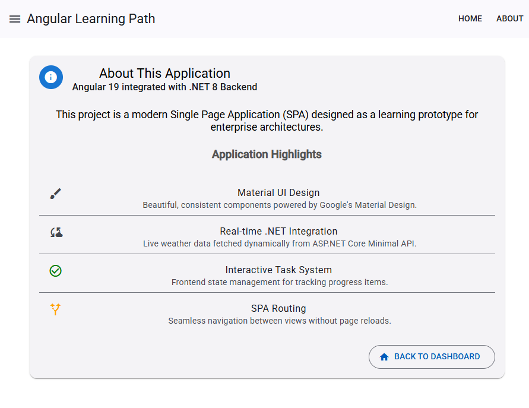

# Progress Checker App (Angular + .NET) 📊

A modern **Full-Stack Web Application** designed to track and manage task progress. This project demonstrates a decoupled architecture using **Angular** for the client-side user interface and **ASP.NET Core Web API** for the backend logic.

## 🚀 Features

* **Decoupled Architecture:** Separation of concerns between the Frontend (SPA) and Backend (API).
* **Progress Tracking:** Visual representation of task completion and status.
* **API Integration:** Angular Services consume RESTful endpoints built with C#.
* **Routing:** Single Page Application (SPA) navigation between Home and About views.
* **Modern UI:** Responsive design using Angular components.

## 📸 Screenshots

### 1. Home Dashboard
*The main interface displaying the progress tracker.*



### 2. About Section
*Project details and information view.*



## 🛠️ Technologies Used

### Frontend
* **Framework:** Angular (TypeScript)
* **Core:** Components, Services, Routing
* **HTTP:** RxJS & HttpClient for API communication

### Backend
* **Framework:** ASP.NET Core Web API
* **Language:** C#
* **Architecture:** RESTful Services, Controllers

## 📦 Getting Started

To run this application, you need to start both the Backend (API) and the Frontend (Angular).

### 1. Backend Setup (.NET)
Navigate to the server directory and run:
```bash
dotnet run
```

*Note the localhost URL (e.g., https://localhost:7000).*

### 2. Frontend Setup (Angular)
Navigate to the client directory, install dependencies, and start the app:

```bash
npm install
ng serve
```
Open your browser and navigate to http://localhost:4200.

## 📬 Contact

If you have questions about this Full-Stack implementation, feel free to reach out:

* **Email:** [mariusc0023@gmail.com](mailto:mariusc0023@gmail.com)
